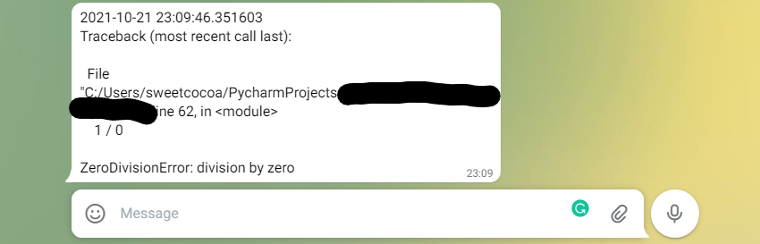

# sweetdebug - Feel easy to debug
---
Automatic pdb, telegram support

## Install
```bash
pip install sweetdebug
```

## Main Feature
- Just add one(or two) line.
```python
from sweetdebug import sweetdebug
sweetdebug()
1/0 # Error !!
```

- This will invoke pdb automatically.

```bash
Traceback (Most recent call last):
3 /main.py <module> --> 1/0
ZeroDivisionError: division by zero
> /main.py(3)<module>()
-> 1/0
(Pdb) 
```


## Other feature(s)
- You can receive error message with Telegram, too.
- prerequisite : python-telegram-bot *(this module will not be automatically installed.)*
```bash
pip install python-telegram-bot
```
```python
# Assume you have Telegram tokens and corresponding chat ids.

token = "123456789:ABCDEF_VGRXDZKwvHS8@Xca5e2EnZdfsgTw"
chat_ids = ["13852425", '29384594']
sweetdebug(telegram_api_token=token, chat_ids=chat_ids)


1/0 # Error !!
```

